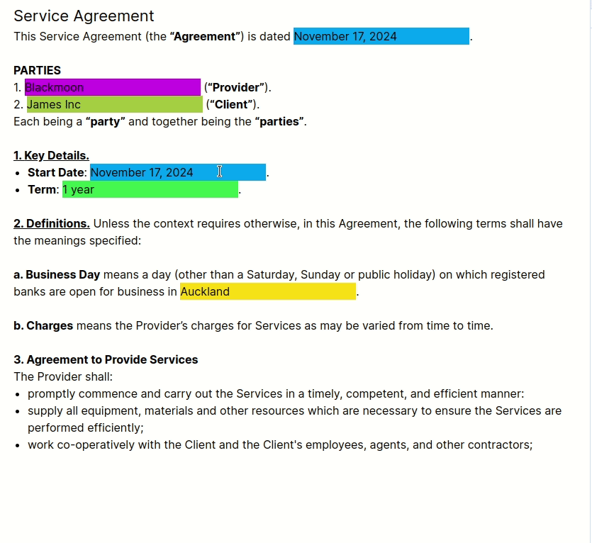

next.js based home project

## note
- use react context to figure out clause level. And together with a global map, figure out clause level-index/number. 
- `page.js` is entry point. 
- `app.js` contains rendering logic with necessary minimum context and global variables. 
  - render json array iteratively and json node recursively
  - some special logic are applied to special node types. mainly `mention` and `clause`
- `utils.js` are extendable helpers based on data formats of input. 
- `context.js` for context
- further improvement: 
  - input validation and pre-prosess. see below additional note about input
  - to make this contract page more interactable with user, use `state` `reducer`.
  - for production code, use mature framework such as `next.js` that uses typescript for type checking

demo:



## additional note about input
- input `input.json` has a `p` element above `ul` which warns 
```
app-index.js:32 Warning: validateDOMNesting(...): <ul> cannot appear as a descendant of <p>.
```
this can be further fixed by validtating input json and, in this case, either ignore that tree under `<p>` or change `<ul>` to `<span>` with the help of [Material UI](https://mui.com/material-ui/api/typography/)
```
<Typography component={'span'} variant={'body2'}>
```
- there's another minor point in input
```
{
"type": "p",
"text": " means a day (other than a Saturday, Sunday or public holiday) on which registered banks are open for business in "
},
{
"color": "rgb(250, 208, 0)",
"type": "mention",
"title": "Governing Law Jurisdiction",
"children": [
    {
    "text": "Auckland"
    }
],
"id": "Governing Law Jurisdiction",
"value": "Auckland"
},
```
in the above array, the first node is a paragraph `p`, forcing following text `Auckland` to be in a new line but the expected output says differently. i believe this is a minor mistake.

## run
### from cmd
```bash
npm run dev
# or
yarn dev
# or
pnpm dev
# or
bun dev
```
### from vs code
set up `./vscode/launch.json` as following
```
{
    "version": "0.2.0",
    "configurations": [
      {
        "name": "Next.js: debug server-side",
        "type": "node-terminal",
        "request": "launch",
        "command": "npm run dev"
      },
      {
        "name": "Next.js: debug client-side",
        "type": "chrome",
        "request": "launch",
        "url": "http://localhost:3000"
      },
      {
        "name": "Next.js: debug full stack",
        "type": "node-terminal",
        "request": "launch",
        "command": "npm run dev",
        "serverReadyAction": {
          "pattern": "- Local:.+(https?://.+)",
          "uriFormat": "%s",
          "action": "debugWithChrome"
        }
      }
    ]
  }
```
and do `ctrl + f5`